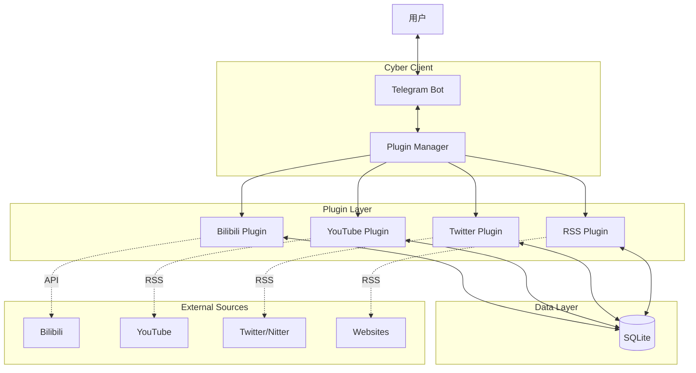

# 🤖 0xRyan.Home.Hub - 智能情报中枢

**0xRyan.Home.Hub** 是一个全源情报聚合与自动化监控系统，旨在将社交媒体、视频平台和 RSS 订阅转化为即时的 Telegram 情报推送。

<div align="center">


**全源情报聚合 · 模块化架构 · 实时监控**

一个基于 Telegram Bot 的模块化全源情报系统。
通过插件化架构 (Plugin Architecture) 集成 Bilibili、YouTube、Twitter/X、RSS 等多平台数据源，提供极速、稳定的实时内容推送。

[功能特性](#-功能特性) • [系统架构](#-系统架构) • [快速开始](#-快速开始) • [命令列表](#-命令列表)

</div>

---

## ✨ 功能特性

### 🔌 核心情报插件
| 插件 | 描述 | 监控频率 |
| :--- | :--- | :--- |
| **Bilibili** | 实时监控直播间状态 (开播/下播)，推送封面与标题 | 1m |
| **YouTube** | 监控频道新视频发布，自动解析 `@handle` | 5m |
| **Twitter/X** | 追踪用户推文更新 (基于 Nitter RSS)，无缝预览 | 10m |
| **General RSS** | 支持任意标准 RSS 源订阅，万物皆可监控 | 10m |

### 🚀 系统优势
- **模块化设计** - 基于 `PluginManager` 的插件架构，轻松扩展新数据源
- **极速响应** - 独立的轮询机制，确保情报第一时间送达
- **可视化面板** - 内置 Telegram Mini App，一览所有订阅状态
- **网络穿透** - 集成 Cloudflare Tunnel，支持 HTTPS 安全访问
- **容器化** - 提供标准 Docker 镜像，一键部署
- **代理支持** - 完善的 `HTTP/HTTPS` 代理适配，无惧网络环境限制

---

## 🏗️ 系统架构

本项目采用最新的 **Plugin Architecture** (插件化架构)：



---

## 🚀 快速开始

### 方式一：Docker Compose (推荐)

1. **克隆仓库**
   ```bash
   git clone https://github.com/Arturia169/0xRyan.Home-Hub.git
   cd 0xRyan.Home-Hub
   ```

2. **配置环境变量**
   ```bash
   cp .env.example .env
   # 编辑 .env 填入 TELEGRAM_BOT_TOKEN
   ```

3. **启动服务**
   ```bash
   docker compose up -d
   ```

### 方式二：本地开发

```bash
cd services/backend
npm install
npm run dev
```

---

## ⚙️ 环境变量配置

在 `.env` 文件中配置以下关键项：

```bash
# Telegram Bot Token (必填)
TELEGRAM_BOT_TOKEN=123456789:ABCdef...

# 允许使用的用户 ID (安全白名单)
ALLOWED_USER_IDS=123456789,987654321

# 代理设置 (中国大陆环境必填)
HTTPS_PROXY=http://127.0.0.1:7890

# Cloudflare Tunnel (可选，用于 Mini App)
CF_TUNNEL_TOKEN=eyJh...
```

---

## 🎮 命令列表

### 📺 Bilibili Live
- `/addbili <房间号>` - 添加直播监控
- `/removebili <房间号>` - 移除监控
- `/list` - 查看所有类型订阅

### 🎬 YouTube
- `/addyt <频道ID 或 @Handle>` - 订阅频道
- `/removeyt <频道ID>` - 取消订阅
- *示例: `/addyt @PewDiePie`*

### 🐦 Twitter (X)
- `/addtw <@用户名>` - 订阅推文
- `/removetw <@用户名>` - 取消订阅
- *示例: `/addtw @ElonMusk`*

### 📰 通用 RSS
- `/addrss <URL> [名称]` - 添加 RSS 订阅
- `/removerss <URL>` - 移除订阅

---

## 🔧 开发者指南 (编写插件)

只需三步即可添加新的数据源（如 Instagram）：

1. 在 `src/plugins/` 下创建新目录 `instagram`.
2. 继承 `BasePlugin` 类并实现 `SourcePlugin` 接口：
   ```typescript
   export class InstagramPlugin extends BasePlugin implements SourcePlugin {
       name = 'instagram';
       label = 'Instagram';
       interval = 60000; // 检查间隔
       
       async checkUpdates() { /* ...实现监控逻辑... */ }
   }
   ```
3. 在 `src/core/PluginManager.ts` 中注册：
   ```typescript
   this.register(new InstagramPlugin());
   ```

---

## 📄 开源协议

MIT License. Made with ❤️ by [Arturia169](https://github.com/Arturia169).
