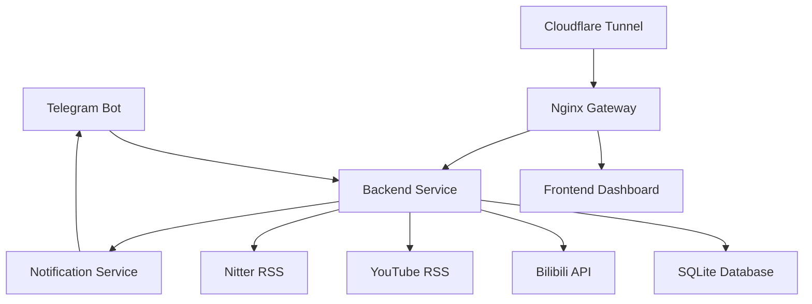

# 🤖 Cyber Base Hub - 赛博基地情报中心

<div align="center">


**全源情报聚合 · 实时推送 · 智能监控**

一个基于 Telegram Bot 的多平台情报监控系统，支持 Bilibili、YouTube、Twitter/X 等平台的实时内容推送。

[功能特性](#-功能特性) • [快速开始](#-快速开始) • [配置说明](#-配置说明) • [使用指南](#-使用指南)

</div>

---

## ✨ 功能特性

### 📺 多平台监控
- **Bilibili** - 直播开播提醒，实时推送封面图和直播信息
- **YouTube** - 频道新视频通知，支持 `@handle` 自动转换
- **Twitter/X** - 用户推文监控，通过 Nitter RSS 实现

### 🚀 核心功能
- ⚡ **实时推送** - 后台自动轮询，新内容即时通知
- 🎯 **智能订阅** - 支持多用户、多订阅源管理
- 🔐 **安全访问** - Cloudflare Tunnel 提供 HTTPS 外网访问
- 📊 **可视化面板** - Telegram Mini App 实时看板
- 🐳 **容器化部署** - Docker Compose 一键启动
- 🌐 **代理支持** - 完整的网络代理配置，适配中国大陆环境

### 🎨 技术亮点
- **TypeScript** - 类型安全的后端开发
- **Grammy** - 现代化的 Telegram Bot 框架
- **SQLite** - 轻量级数据库，零配置
- **RSS Parser** - 高效的 RSS 订阅解析
- **Nginx** - 反向代理与负载均衡
- **GitHub Actions** - 自动化 CI/CD 构建

---

## 🏗️ 系统架构



**服务组件：**
- `backend` - Node.js 后端服务（Bot + API + 监控）
- `frontend` - React 控制面板（Mini App）
- `gateway` - Nginx 反向代理
- `cloudflare-tunnel` - HTTPS 隧道服务

---

## 🚀 快速开始

### 前置要求
- Docker & Docker Compose
- Telegram Bot Token（从 [@BotFather](https://t.me/BotFather) 获取）
- Cloudflare Tunnel Token（可选，用于外网访问）

### 一键部署

```bash
# 1. 克隆仓库
git clone https://github.com/Arturia169/0xRyan.Home-Hub.git
cd 0xRyan.Home-Hub

# 2. 配置环境变量
cp .env.example .env
nano .env  # 填写必要的配置

# 3. 启动服务
docker compose up -d

# 4. 查看日志
docker compose logs -f backend
```

---

## ⚙️ 配置说明

### 环境变量 (`.env`)

```bash
# ===== Telegram Bot 配置 =====
TELEGRAM_BOT_TOKEN=your_bot_token_here
ALLOWED_USER_IDS=123456789,987654321  # 允许使用 Bot 的用户 ID（逗号分隔）

# ===== Cloudflare Tunnel（可选）=====
CF_TUNNEL_TOKEN=your_tunnel_token_here

# ===== 代理配置（中国大陆必需）=====
HTTPS_PROXY=http://192.168.5.100:7890  # 代理服务器地址

# ===== Mini App 配置（可选）=====
WEBAPP_URL=https://bot.yourdomain.com  # Mini App 访问地址
HOME_DASHBOARD_API_KEY=your_secure_api_key  # 控制面板 API 密钥
```

### Docker Compose 配置

**关键配置项：**
- `network_mode: host` - 后端使用宿主机网络（解决代理连接问题）
- `dns: [8.8.8.8, 1.1.1.1]` - Cloudflare Tunnel 使用公共 DNS
- `NO_PROXY` - 内网服务直连，外网流量走代理

---

## 📖 使用指南

### Bot 命令列表

#### 📺 Bilibili 监控
```
/addbili <房间号>           # 添加直播监控
/listbili                   # 查看监控列表
/removebili <房间号>        # 移除监控
```

#### 🎬 YouTube 监控
```
/addyt <频道ID或@用户名> [名称]   # 添加频道订阅
/listyt                           # 查看订阅列表
/removeyt <频道ID>                # 取消订阅
```

**示例：**
```
/addyt @thirteennn013 拾参 Thirteen
/addyt UCxxxxxx 某个频道
```

#### 🐦 Twitter/X 监控
```
/addtw <@用户名> [名称]     # 添加用户监控
/listtw                     # 查看订阅列表
/removetw <@用户名>         # 取消订阅
```

**示例：**
```
/addtw @elonmusk 马斯克
```

#### 🛠️ 其他命令
```
/start    # 初始化用户数据
/help     # 查看帮助信息
```

### 通知消息示例

**Bilibili 开播通知：**
```
📺 主播名 开播啦！

📝 标题: 直播标题
👀 人气: 12345
🏷 分区: 娱乐 - 聊天
⏰ 时间: 2026-01-18 18:00:00

👉 点击进入直播间
```
*附带直播间封面图*

**YouTube 新视频通知：**
```
📺 频道名 发布了新视频！

视频标题

⏰ 2026-01-18 18:00:00
🔗 点击观看
```
*附带视频缩略图*

**Twitter 新推文通知：**
```
🐦 用户名 发布了推文

推文内容

🔗 查看推文
```

---

## 🔧 开发指南

### 本地开发

```bash
# 后端开发
cd services/backend
npm install
npm run dev

# 前端开发
cd services/frontend
npm install
npm run dev
```

### 项目结构

```
cyber-base-hub/
├── services/
│   ├── backend/          # Node.js 后端服务
│   │   ├── src/
│   │   │   ├── bot/      # Telegram Bot 逻辑
│   │   │   ├── api/      # API 服务器
│   │   │   ├── services/ # 监控服务（Bilibili/YouTube/Twitter）
│   │   │   ├── database/ # 数据库模型与查询
│   │   │   └── utils/    # 工具函数
│   │   └── Dockerfile
│   └── frontend/         # React 前端
├── gateway/
│   └── nginx.conf        # Nginx 配置
├── docker-compose.yml    # Docker Compose 配置
└── .env                  # 环境变量
```

### 数据库结构

**核心表：**
- `users` - 用户信息
- `bilibili_streamers` - Bilibili 订阅
- `youtube_channels` - YouTube 订阅
- `twitter_users` - Twitter 订阅

---

## 🌐 网络配置

### 代理设置（中国大陆）

由于 Telegram API、YouTube、Twitter 在中国大陆无法直接访问，需要配置代理：

1. **后端服务** - 通过 `HTTPS_PROXY` 环境变量配置
2. **Cloudflare Tunnel** - 通过 `TUNNEL_HTTP_PROXY` 配置
3. **Docker 网络** - 使用 `network_mode: host` 确保容器能访问宿主机代理

### Cloudflare Tunnel 配置

1. 在 Cloudflare Zero Trust 创建 Tunnel
2. 配置 Public Hostname：
   - Subdomain: `bot`
   - Domain: `yourdomain.com`
   - Service: `http://cyber-gateway:80`
3. 复制 Tunnel Token 到 `.env` 的 `CF_TUNNEL_TOKEN`

---

## 📊 监控频率

- **Bilibili** - 每 3 分钟检查一次
- **YouTube** - 每 5 分钟检查一次
- **Twitter** - 每 10 分钟检查一次

---

## 🐛 故障排查

### Bot 无响应
```bash
# 检查容器状态
docker compose ps

# 查看后端日志
docker compose logs backend --tail 50

# 检查代理连接
curl -v http://127.0.0.1:7890
```

### 外键约束错误
确保在添加订阅前先发送 `/start` 初始化用户数据。

### Cloudflare Tunnel 502 错误
检查 `NO_PROXY` 配置，确保内网服务不走代理。

---

## 📝 更新日志

### v2.0.0 (2026-01-18)
- ✨ 新增 YouTube 频道监控
- ✨ 新增 Twitter/X 用户监控
- ✨ 支持 YouTube Handle (`@用户名`) 自动转换
- 🐛 修复外键约束错误
- 🐛 修复 Docker 网络代理连接问题
- 🔧 优化 Cloudflare Tunnel 配置
- 📝 完善帮助文档

### v1.0.0
- 🎉 初始版本
- ✨ Bilibili 直播监控
- ✨ Telegram Mini App 控制面板

---

## 📄 开源协议

本项目采用 [MIT License](LICENSE) 开源协议。

---

## 🙏 致谢

- [Grammy](https://grammy.dev/) - Telegram Bot 框架
- [Cloudflare](https://www.cloudflare.com/) - Tunnel 服务
- [Nitter](https://github.com/zedeus/nitter) - Twitter RSS 代理

---

<div align="center">

**Made with ❤️ by [Arturia169](https://github.com/Arturia169)**

如果这个项目对您有帮助，请给个 ⭐ Star 支持一下！

</div>
